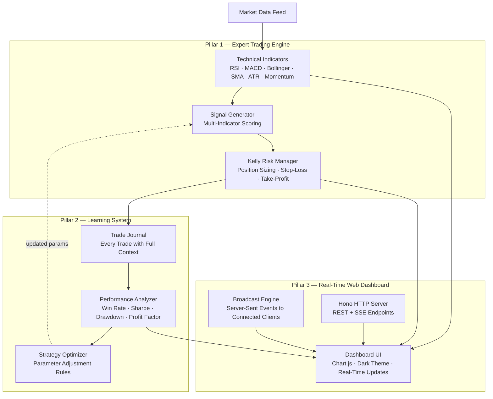

# Crypto Trader — The Three Pillars

> This document describes the three fundamental architectural pillars that make up the
> crypto-trader app. Every line of code belongs to exactly one pillar, and the pillars
> communicate through well-defined interfaces. Understanding these three pillars is
> the fastest way to understand the whole system.

---

## Pillar Overview



---

# Pillar 1: Expert Trading Engine

**Location:** `src/strategy/`

**Purpose:** Simulate how a professional trader analyzes the market before making a
decision. Instead of using a single indicator or a simple threshold, this pillar combines
**six different technical indicators** into a scored consensus signal.

## Components

### 1A — Technical Indicators (`src/strategy/indicators.ts`)

Six pure functions, each taking price history and returning a numerical value:

| Indicator | Function | What it measures | Typical range |
|---|---|---|---|
| **RSI** (Relative Strength Index) | `calcRSI(prices, period=14)` | Overbought/oversold momentum | 0–100 |
| **MACD** (Moving Average Convergence/Divergence) | `calcMACD(prices)` | Trend direction & momentum crossover | Bullish/bearish flag |
| **SMA** (Simple Moving Average) | `calcSMA(prices, period)` | Trend baseline | Price level |
| **Bollinger Bands** | `calcBollinger(prices, period=20, multiplier=2)` | Volatility & overextension bands | Upper/middle/lower ± width |
| **ATR** (Average True Range) | `calcATR(highs, lows, closes, period=14)` | Market volatility | Price units |
| **Momentum** | `calcMomentum(prices, period=10)` | Short-term price velocity | Percentage change |

Each indicator is a **pure function** — it takes numbers in, returns a number out.
No state, no side effects. This makes them trivially testable and composable.

### 1B — Signal Generator (`src/strategy/signals.ts`)

The signal generator is the **decision-making brain**. It:

1. **Records each new price tick** into an in-memory `PriceHistory` per symbol (keeps last 100 data points)
2. **Calculates all 6 indicators** against the current price history
3. **Scores the market** using a weighted consensus system:

```typescript
// Scoring rules (buyScore and sellScore start at 0)
RSI < 30              → buyScore += 3    (oversold — buy opportunity)
RSI > 50 and < 60     → buyScore += 1    (neutral-bullish)
RSI > 70              → sellScore += 3   (overbought — exit signal)

MACD bullish cross    → buyScore += 3    (trend turning up)
MACD bearish diverg.  → sellScore += 2   (trend weakening)

Price < lower band    → buyScore += 2    (oversold by volatility)
Price > upper band    → sellScore += 2   (overbought by volatility)

Momentum 2–15%        → buyScore += 2    (healthy trend)
Momentum < -5%        → sellScore += 2   (strong downtrend)

Volume surge + up     → buyScore += 1    (volume confirms trend)
Volume surge + down   → sellScore += 1

Price > SMA(20)       → buyScore += 1    (above trend = bullish)
Price < SMA(20)       → sellScore += 1   (below trend = bearish)

ATR > 5% of price     → sellScore += 1   (too volatile — avoid)
```

4. **Decision logic:**
   - If `buyScore >= 4` and `buyScore >= sellScore` → **BUY** with confidence `0.4 + buyScore × 0.1`
   - If `sellScore >= 4` and `sellScore > buyScore` → **SELL** with confidence `0.4 + sellScore × 0.1`
   - Otherwise → **HOLD**

5. **Position management override:** If a position already exists, the generator checks
   stop-loss and take-profit levels BEFORE running the scoring. If either is triggered,
   a SELL signal is returned immediately with high confidence.

**Output** — a `TradeSignal` object containing:
- `type`: `"buy" | "sell" | "hold"`
- `confidence`: 0–1 (mathematically derived from the score)
- `reason`: human-readable string explaining the decision
- `indicators`: snapshot of all 6 indicator values at decision time (critical for the Learning Pillar)

### 1C — Kelly Risk Manager (`src/strategy/risk.ts`)

Once a signal is generated, the Kelly Risk Manager determines **how much** to trade using
the **Kelly Criterion** — a mathematical formula from information theory that maximizes
long-term growth:

```
Kelly Fraction = max(0, (confidence - 0.5) × 2)

Position Size = availableCash × 0.9 × kellyFraction
                clamped to ≤ maxPositionSizeUsd
                clamped to ≤ availableCash
```

This means:
- **Confidence ≤ 50%** → position size = 0 (don't trade)
- **Confidence 75%** → invest 50% of available cash
- **Confidence 100%** → invest 100% (capped by maxPositionSizeUsd)

The Kelly fraction is multiplied by 0.9 to keep a 10% cash reserve for fees.

Additionally, this module provides **performance metrics** used by Pillar 2:
- `calcMaxDrawdown(values)` — largest peak-to-trough decline
- `calcSharpe(returns)` — risk-adjusted return (annualized)
- `calcWinRate(pnls)` — percentage of winning trades
- `calcProfitFactor(pnls)` — gross profit / gross loss

---

# Pillar 2: Learning System

**Location:** `src/learning/`

**Purpose:** Make the system improve over time by recording every trade, analyzing
performance, and automatically adjusting strategy parameters. This is the difference
between a static trading bot and one that "learns from its mistakes."

## Components

### 2A — Trade Journal (`src/learning/journal.ts`)

Records **every executed trade** with full context. Each `TradeRecord` contains:

```
id: number                 — unique trade ID
symbol: string             — e.g. "BTC/USDT"
side: "buy" | "sell"       — direction
entryTime: number          — when the trade was opened
exitTime?: number          — when it was closed (if closed)
entryPrice: number         — price at entry
exitPrice?: number         — price at exit (if closed)
quantity: number           — amount traded
fee: number                — transaction cost
pnl?: number               — realized profit/loss (computed on exit)
pnlPercent?: number        — P&L as percentage
confidence: number          — the confidence score at entry time
reason: string             — the signal reason at entry time
indicatorsAtEntry: {       — snapshot of ALL 6 indicator values
  rsi: number
  momentum: number
  atr: number
}
status: "open" | "closed"  — whether the position is still held
```

The journal tracks:
- **Open trades** — positions currently held (no exit recorded yet)
- **Closed trades** — completed trades with realized P&L
- **All trades** — the complete history

When a SELL or take-profit/stop-loss closes a position, `recordExit()` computes the
realized P&L and P&L percentage automatically.

### 2B — Performance Analyzer (`src/learning/analyzer.ts`)

Called periodically (every 30 seconds), this analyzes all closed trades and computes:

| Metric | Formula | What it tells you |
|---|---|---|
| **Win Rate** | `wins / totalTrades` | What fraction of trades are profitable |
| **Total P&L** | `sum of all pnl` | Net profit/loss in USD |
| **Total Return** | `pnl / initialCash × 100` | Percentage return on starting capital |
| **Sharpe Ratio** | `avg(return) / std(return) × √365` | Risk-adjusted return (> 1 = good) |
| **Profit Factor** | `grossProfit / grossLoss` | How many dollars earned per dollar lost |
| **Max Drawdown** | `max(peak - trough) / peak × 100` | Worst decline from peak |
| **Avg Win** | `average of profitable trades` | Typical winning trade size |
| **Avg Loss** | `average of losing trades` | Typical losing trade size |
| **Largest Win/Loss** | `max/min of all pnls` | Best and worst trades |
| **Win Rate by Symbol** | per-symbol breakdown | Which symbols perform best |

The analyzer also builds an **equity curve** — an array of portfolio values after each
trade — which becomes the line chart on the dashboard.

### 2C — Strategy Optimizer (`src/learning/optimizer.ts`)

This is the **"learning from mistakes"** engine. It runs after every performance analysis
and applies deterministic rules to adjust strategy parameters:

**Parameters that can be adjusted:**

| Parameter | Default | Range | Effect |
|---|---|---|---|
| `rsiOversoldThreshold` | 30 | 25–35 | Lower = only extreme oversold triggers buys |
| `rsiOverboughtThreshold` | 70 | 70–78 | Higher = only extreme overbought triggers sells |
| `minBuyScore` | 4 | 4–6 | Higher = more evidence needed before buying |
| `volatilityCap` | 5% | 3–5% | Lower = avoid more volatile markets |

**The optimization rules (applied every 30s):**

| Condition | Adjustment | Rationale |
|---|---|---|
| Win rate < 40% AND at least 5 trades | `minBuyScore += 1` (up to 6) <br/> `rsiOversoldThreshold -= 2` (down to 25) | "I'm losing too often — wait for stronger signals" |
| Win rate > 65% AND 5–20 trades | `rsiOversoldThreshold += 2` (up to 35) | "I'm doing well — cautiously expand opportunities" |
| Avg loss > avg win × 1.5 | `volatilityCap -= 0.5` (down to 3%) | "My losses are too big — avoid volatile markets" |
| Max drawdown > 15% | `rsiOverboughtThreshold += 2` (up to 78) | "Portfolio is dropping too much — exit sooner" |

**Only one parameter is adjusted per cycle** to isolate cause and effect.

Every adjustment is recorded as a `LearningInsight`:
```
{
  param: "minBuyScore",
  oldValue: 4,
  newValue: 5,
  reason: "win rate 33% < 40% → minBuyScore 5",
  round: 7
}
```

These insights are streamed to the dashboard in real-time so you can see *what* the
system learned and *why*.

---

# Pillar 3: Real-Time Web Dashboard

**Location:** `src/server/`

**Purpose:** Give the user complete visibility into what the trading engine is doing in
real-time, with professional-grade visualizations and zero setup beyond opening a browser.

## Components

### 3A — Hono HTTP Server (`src/server/index.ts`)

Built on **Hono** (a lightweight, ultra-fast web framework for Node/Deno/Bun), the server
provides three endpoints:

| Endpoint | Method | Purpose |
|---|---|---|
| `/` | GET | Serves the dashboard HTML (`public/index.html`) |
| `/events` | GET | SSE (Server-Sent Events) real-time stream |
| `/api/state` | GET | Full current state as JSON (for initial page load) |
| `/api/history` | GET | Complete trade history as JSON |

**SSE Implementation:**

```
Client connects → receives "init" event with full state
               → receives "market" events every refreshInterval (2s)
               → receives "trade" events when trades execute
               → receives "learning" events every 30s
               → ": keepalive" comment events every 30s to keep connection open
```

The SSE uses a `TransformStream` to pipe data to connected clients. When a client
disconnects, their writer is automatically cleaned up.

### 3B — Dashboard UI (`src/server/public/index.html`)

A **single HTML file** with embedded CSS and JavaScript (no build step, no framework).
Uses **Chart.js** (loaded from CDN) for the equity curve.

**Layout sections:**

```
┌─────────────────────────────────────────────────────────┐
│  📊 Crypto Trader                    [PAPER]            │
├─────────────┬──────────────┬────────────┬───────────────┤
│ Portfolio   │ Cash         │ Open       │ Win Rate      │
│ Value       │ $8,999.00    │ Positions  │ 50%           │
│ $14,100.00  │              │ 2          │ 2 closed      │
├─────────────┴──────┬───────┴────────────┴───────────────┤
│ Total P&L  │ Profit Factor│ Sharpe     │ Max Drawdown   │
│ +$100.50   │ 1.5         │ 0.82       │ 5.2%           │
├────────────────────┴────────────────────────────────────┤
│ 📈 Market                                               │
│ ┌─────────┐ ┌─────────┐ ┌─────────┐                    │
│ │BTC/USDT │ │ETH/USDT │ │SOL/USDT │                    │
│ │$41,398  │ │$40,764  │ │$40,682  │                    │
│ │↑ 4.6%   │ │↑ 4.1%   │ │↓ -4.3%  │                    │
│ └─────────┘ └─────────┘ └─────────┘                    │
├────────────────────────────────────────────────────────┤
│ 📉 Equity Curve (Chart.js line chart)                   │
├──────────────────────────────────┬─────────────────────┤
│ 🔄 Recent Trades                │ 🧠 Learning Insights │
│ Time │Sym │Side│Price  │P&L     │ ◆ minBuyScore 4→5   │
│ 12:00│BTC │ BUY│$41398 │—      │ ◆ volatility 5→4.5% │
│ 12:00│ETH │ BUY│$40764 │—      │                      │
├──────────────────────────────────┴─────────────────────┤
│ Strategy Parameters                                     │
│ RSI oversold: 30 · RSI overbought: 70 · Min score: 4   │
├────────────────────────────────────────────────────────┤
│ 🟢 Status: PAPER | buy BTC/USDT @ $41398               │
└────────────────────────────────────────────────────────┘
```

**Color coding throughout:**
- **GREEN** → good (positive change, win, Sharpe ≥ 1, drawdown < 10%)
- **YELLOW** → warning (neutral change, Sharpe 0–1, drawdown 10–20%)
- **RED** → danger (negative change, loss, Sharpe < 0, drawdown > 20%)

### 3C — Broadcast Engine

The broadcast engine is the **nervous system** connecting the trading loop to the dashboard:

```typescript
// In src/server/index.ts:
const sseClients = new Set<{ write, cleanup }>();

export function broadcast(event: string, data: unknown): void {
  const payload = `event: ${event}\ndata: ${JSON.stringify(data)}\n\n`;
  for (const client of sseClients) {
    client.write(payload);
  }
}
```

**What gets broadcast and when:**

| Event | Frequency | Payload |
|---|---|---|
| `init` | On client connect | Full dashboard state |
| `market` | Every refreshInterval (~2s) | Market snapshots, portfolio, status |
| `trade` | On every buy/sell execution | Updated trade history, performance report |
| `learning` | Every 30s | New insights, adjusted params, updated report |

The broadcast engine is called from `src/main.ts` — the main loop updates state, then
calls `broadcast("market", ...)` or `broadcast("trade", ...)` every cycle.

### 3D — Data flow through the dashboard

```
Market data arrives → main.ts updates state
                    ↓
              broadcast("market", { marketData, portfolio, statusMessage })
                    ↓
              SSE pushes to all connected browsers
                    ↓
              JavaScript EventSource handler receives "market" event
                    ↓
              updateMarket() → re-renders market cards with color coding
              updatePortfolio() → updates portfolio value, cash, positions
              document.getElementById('status-bar') → shows latest status
```

When a trade executes, the same flow sends a `"trade"` event which triggers:
- `updateTrades()` → appends the new trade row to the table
- `updatePerformance()` → refreshes all metric cards and redraws the equity chart
- `updateInsights()` → adds new learning insights if any

---

## How the Three Pillars Work Together

### Normal operation cycle (every ~2 seconds)

```
1. MARKET FEED (src/market.ts) produces snapshots
       │
       ▼
2. PILLAR 1 — Expert Trading Engine (src/strategy/)
       │
       ├─ indicators.ts → calculates RSI, MACD, Bollinger, etc.
       ├─ signals.ts → scores, decides buy/sell/hold
       └─ risk.ts → Kelly position sizing
       │
       ▼
3. If trade signal:
       ├─ src/executor.ts → executes trade
       ├─ src/portfolio.ts → updates holdings
       └─ PILLAR 2 — Learning System (src/learning/)
            └─ journal.ts → records the trade with indicator snapshot
       │
       ▼
4. PILLAR 3 — Web Dashboard (src/server/)
       ├─ broadcast("market") → updates prices live
       └─ broadcast("trade") → updates trades and performance
```

### Learning cycle (every 30 seconds)

```
1. PILLAR 2 reads all closed trades from journal.ts
       │
       ▼
2. analyzer.ts computes: win rate, Sharpe, drawdown, profit factor
       │
       ▼
3. optimizer.ts applies learning rules against current params
       │
       ▼
4. Updated params flow back → PILLAR 1 (signals.ts uses them in next cycle)
       │
       ▼
5. broadcast("learning") → PILLAR 3 shows insights on dashboard
```

### Startup sequence

```
1. main.ts reads config (config.ts)
2. Creates empty portfolio, starts market watcher (market.ts)
3. Starts web server on port 3081 (server/index.ts)
   → dashboard is immediately accessible
4. Enters main loop:
   wait for market data → Pillar 1 → Pillar 2 → Pillar 3 → repeat
```

---

## Why Three Pillars?

| Single reason | Why it matters |
|---|---|
| **Separation of concerns** | The trading logic, the learning logic, and the UI logic are completely independent. You can replace the dashboard with a Telegram bot without touching the trading engine. |
| **Testability** | Each pillar is tested independently. The trading engine has pure functions with no I/O. The learning system works on in-memory data. The server can be tested with HTTP requests. |
| **Observability** | The learning system produces insights that are visible on the dashboard. You can see *what* the system learned and *why* — no black box. |
| **Evolvability** | Want to add a new indicator? Add it to `indicators.ts` and update the scoring in `signals.ts`. Want to add a new learning rule? Add it to `optimizer.ts`. The other pillars don't change. |

---

## File-to-Pillar Map

| File | Pillar |
|---|---|
| `src/strategy/indicators.ts` | 🟦 Pillar 1 — Expert Trading Engine |
| `src/strategy/signals.ts` | 🟦 Pillar 1 — Expert Trading Engine |
| `src/strategy/risk.ts` | 🟦 Pillar 1 — Expert Trading Engine |
| `src/learning/journal.ts` | 🟩 Pillar 2 — Learning System |
| `src/learning/analyzer.ts` | 🟩 Pillar 2 — Learning System |
| `src/learning/optimizer.ts` | 🟩 Pillar 2 — Learning System |
| `src/server/index.ts` | 🟧 Pillar 3 — Real-Time Web Dashboard |
| `src/server/public/index.html` | 🟧 Pillar 3 — Real-Time Web Dashboard |
| `src/config.ts` | Shared (all pillars read config) |
| `src/market.ts` | Data Source (feeds Pillar 1) |
| `src/portfolio.ts` | Shared State (Pillar 1 writes, Pillar 3 reads) |
| `src/executor.ts` | Shared (Pillar 1 signals, Pillar 2 journals) |
| `src/main.ts` | Orchestrator (wires all three pillars) |
| `src/tui.ts` | Legacy (terminal fallback, not in active pillars) |