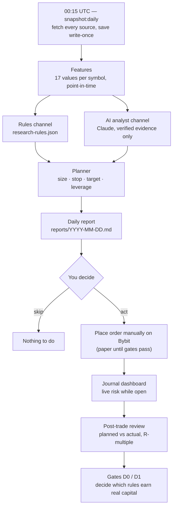

# Daily Workflow — Catalyst Research, Manual Execution, Trade Journal

Once a day, the system collects fundamental and catalyst data, runs your rules and the AI analyst on
the same point-in-time snapshot, and writes a report. **You** read it, decide, and place any order by
hand on Bybit. A local dashboard tracks the trade while it is open and reviews it after it closes.
Nothing trades automatically, and no plan may use real money or leverage until its gates pass.

> Contract: [`specs/daily-catalyst-manual-trading.md`](../specs/daily-catalyst-manual-trading.md).
> This guide explains how to *use* the system; the spec is the source of truth when they disagree.

---

## Status — what works today

| Phase | What it gives you | Status |
|-------|-------------------|--------|
| 1 — Data foundation | `npm run snapshot:daily`: fetch sources, save point-in-time snapshots, compute features | ✅ Built |
| 2 — Rules, planner, report | `npm run research:daily`: rules → sized trade plans → daily report | ✅ Built |
| 3 — Journal & dashboard | `npm run journal`: read-only fill import, live view, post-trade review | ✅ Built |
| 3b — Trade chart & replay | Price chart per trade with plan levels, volatility range, live follow and candle-by-candle replay | ✅ Built |
| 4 — Backtest & gates | `npm run backfill` + `npm run backtest:daily`: dev backtests, Gate D0 (holdout) and Gate D1 (paper) verdicts | ✅ Built |
| 4b — AI analyst | Claude assesses each rule plan and proposes up to 3 ideas, via the `claude-cli` subscription by default (or `anthropic-api`) | ✅ Built — AC-54/AC-54a live-smoke sign-off pending |
| 5 — Analyst persona | Interactive Claude Code skill to write and critique rules | ⏳ Planned |

This table is updated at the end of every phase.

---

## The daily cycle



### Your 10-minute routine

1. **Read the banner** at the top of `reports/<today>.md`. `INCOMPLETE` means a source failed — plans that depend on it are marked `not_evaluable`, never guessed.
2. **Read the rules channel.** Each plan shows the rule that fired, the evidence values, entry reference, stop, target, size, leverage and liquidation buffer. The AI's stance (support / caution / oppose) sits next to it.
3. **Read the AI channel** (labeled *forward-only, unvalidated*): its regime summary, its own ideas, notes on your open trades.
4. **Decide.** Check `venueIntent`: `paper` means record it as a paper trade, not a real order.
5. **Act.** Place the order yourself on Bybit — or record the paper entry in the journal.
6. **Link it.** In the journal dashboard, link the position to its `planId` so it is measured against the plan.
7. **While open:** watch distance to stop, distance to liquidation, funding paid, and whether the thesis still holds.
8. **After close:** read the review, add notes. Adherence and R-multiple feed the gates.

---

## What each stage guarantees

| Stage | Guarantee | Why it matters |
|-------|-----------|----------------|
| Snapshot | Saved once, SHA-256 checked, never overwritten (`--revision N` adds a new file) | You can always see exactly what the system knew that day |
| Point-in-time rule | A value counts only if it was available at decision time | Prevents the look-ahead bias that makes backtests lie |
| Decision time | Scheduled 00:15 UTC; in a live run it becomes the moment the last fetch finished (if within 2 h) | Sources fetched seconds after 00:15 are still usable; backdated runs stay honest |
| Failure handling | Missing, stale or malformed data → `missing` / `not_evaluable`, loudly | The system never fills a gap with yesterday's value |
| Planner | Size from risk per trade and stop distance; leverage is an *output*; liquidation must be ≥ 2× the stop distance away | Leverage cannot be dialed up by hand or by the AI |
| AI analyst | Every claim must cite a snapshot value or a URL it actually retrieved; unverifiable claims are dropped | AI opinions never enter a money decision as unchecked "facts" |
| Journal | Read-only Bybit key, verified at startup; atomic writes with 5 backups | The system can see your account, never trade on it |

---

## Gates — the only path to real money

| Gate | Applies to | Pass condition (summary) | Command |
|------|-----------|--------------------------|---------|
| **D0 — holdout** | Each rule (not AI, not `forwardOnly` rules) | Last 12 months held out; ≥ 30 trades; mean R > 0 with 90% CI above 0; beats random-entry control; max 3 attempts per rule | `npm run backtest:daily -- --rule <id> --mode holdout` |
| **D1 — forward paper** | Each rule after D0; the AI channel; `forwardOnly` rules | ≥ 30 paper trades (60 for AI / forward-only) over ≥ 45 days; expectancy > 0; adherence ≥ 90% | `npm run backtest:daily -- --rule <id> --mode d1-check` |
| **Leverage ladder** | After D1 | First 20 live trades capped at 2×; raising `maxLeverage` is your manual config commit | — |

You review every gate artifact (`data/validation/daily/*.json`) and change a rule's `status` yourself.
Why the AI skips D0: its training data runs to May 2026, inside the holdout window — a backtest of it would be cheating.

> **D0 is a filter, not proof.** You lived through the holdout year while writing your rules, so it is not
> blind for you either. Only Gate D1 — paper trading forward — is truly out of sample.

### Testing a rule (Gates D0 and D1)

1. **Get the data.** `npm run backfill -- --from 2024-01-01 --to <yesterday>`. Rules using ETF flows need the
   full-history Farside CSVs in `data/manual/`; rules using CPI timing need `FRED_API_KEY`. Without them those
   rules are `not_evaluable` on every day — the backtest never fills the gap.
2. **Iterate in dev.** `npm run backtest:daily -- --rule <id> --mode dev` as often as you like. It only uses days
   before 2025-09-16 and never touches the holdout budget. Artifact: `data/validation/daily/dev-<id>-<date>.json`.
3. **Commit the rule.** `research-rules.json` must have no uncommitted changes — the holdout run records the commit
   it tested (pre-registration). Tuning after a failure stays visible in git history.
4. **Run Gate D0 once you're confident.** `npm run backtest:daily -- --rule <id> --mode holdout`.
   - It writes a ledger line **before** running, so even a crash uses an attempt. Max 3 attempts per rule.
   - Every holdout run of *any* rule makes the significance bar stricter for all later runs
     (`alpha = 0.10 / total runs`), so renaming a rule to get more tries only hurts.
   - It uses fixed inputs: no custom ledger, rules file, history, seed or sample counts; slippage can only go up (≥ 5 bps).
5. **Read the artifact** `gate-d0-<id>-<date>.json`: `verdict`, `verdictReason`, trades, mean R, CI, p-value, alpha.
   Only `edge_confirmed` lets you set the rule's `status` to `holdout-passed` (commit that change).
6. **Paper trade it** for at least 45 days / 30 trades, then run `--mode d1-check`. Only trades recorded with the
   rule's current version count; changing the rule restarts D1.

| D0 verdict | What it means |
|-----------|---------------|
| `edge_confirmed` | Every check passed. Still only a filter — go to paper trading |
| `no_edge` | One check failed; `verdictReason` names the step (mean R, confidence interval, random-timing control, concentration, drawdown) |
| `insufficient_data` | Fewer than 30 trades or 20 trading days, or the random-timing control couldn't complete. Often caused by small capital (plans below Bybit's minimum size) |
| `holdout_exhausted` | This rule already used its 3 attempts |

What the backtest assumes, so you can judge the results: entry at the next hourly open after 00:15 UTC,
5 bps slippage each way plus 0.055% taker fees, a stop hit inside an hour always wins over the target, and
funding charged at every real settlement. Any gap in prices or funding makes that trade "unfilled" rather
than guessed.

---

## Before your first live trade

Passing the gates proves a rule. These checks prove the **journal** tells the truth about real money.
Do all of them before the first order with `venueIntent: "live"`. Record the date and result of each
in `docs/validation/live-readiness.md`.

| # | Check | Status | How | Pass when |
|---|-------|--------|-----|-----------|
| 1 | **Read-only key syncs your mainnet account** | ✅ Done 2026-09-16 | `npm run journal` with a mainnet read-only key and `manual.journalStartTime` set | `/api/state` shows `liveSync: "enabled"` and `lastSync.status: "ok"` |
| 2 | **A key with trade permission is refused** | ⏸ Pending | Start `npm run journal` with a mainnet key that has Trade permission (then delete or restrict that key) | Exits with `refusing to start: Bybit API key has trade or withdraw permission` — not `listening on …` |
| 3 | **Real fills become the right trade** | ⏸ Pending | Open and close one minimum-size position; watch the dashboard | One trade with the correct side, entry/exit prices, fees and exit label; no sync warnings |
| 4 | **Funding sign is correct** | ⏸ Pending | Hold that position through a funding settlement; note the rate's sign and your side beforehand | Dashboard funding equals Bybit's transaction-log entry in amount **and** sign (positive rate + long = negative). Then set `manual.fundingSignVerified: true` |
| 5 | **Plan linking works on a real position** | ⏸ Pending | Link that position to a plan from the same day's report | Link accepted; review shows planned vs actual |
| 6 | **Stale data is flagged** | ⏸ Pending | With a position open, cut the network for more than 2 minutes | Header shows `STALE since <time>` and P&L is blanked; clears after reconnecting |
| 7 | **Screenshots saved** | ⏸ Pending | Live panel, stale state, closed-trade review | `docs/validation/journal-dashboard-<date>-{live,stale,review}.png` committed |

> Checks 3–7 need a real position, which means real fees and market risk. Use the smallest size Bybit
> allows. Whether and when to do it is your decision.

How to load a key without it landing in shell history (type the line in the terminal, one shell):

```bash
read -rsp "key: " BYBIT_READONLY_API_KEY && echo && read -rsp "secret: " BYBIT_READONLY_API_SECRET && echo && BYBIT_READONLY_API_KEY="$BYBIT_READONLY_API_KEY" BYBIT_READONLY_API_SECRET="$BYBIT_READONLY_API_SECRET" npm run journal
```

If any check fails, stop: no live trade until it is fixed and the check passes again.

---

## Setup

### One-time

| Item | How | Needed for |
|------|-----|-----------|
| `config.json` | Existing config; `symbols` drives which markets are researched | everything |
| `FRED_API_KEY` | Free key from FRED, stored in the secrets file (see [Secrets and the daily schedule](#secrets-and-the-daily-schedule)) | `hoursToNextCpi` |
| `data/manual/macro-calendar.json` | FOMC statement times (UTC). Seeded with the remaining 2026 meetings; keep `asOf` fresh (≤ 120 days) | `hoursToNextFomc` |
| `data/manual/unlocks.json` | Token unlocks for your symbols' base assets; update `asOf` at least weekly | `daysToNextUnlock`, `nextUnlockPctOfFloat` |
| Schedule | systemd user timer running `research:daily` at 00:15 UTC (see [Secrets and the daily schedule](#secrets-and-the-daily-schedule)) | the daily cycle |
| `research-rules.json` | Your rule set. Ships with 3 `EXAMPLE` rules — replace them with your own (format below) | rules channel |
| Read-only Bybit key | Create an API key with **read-only** permission (no Trade, no Withdraw) and export `BYBIT_READONLY_API_KEY` / `BYBIT_READONLY_API_SECRET`. The journal refuses to start with any other key | live sync |
| `manual.journalStartTime` | ISO time in `config.json` (e.g. `"2026-09-17T00:00:00Z"`). Only executions after it are journaled, so old auto-trader history stays out | live sync |
| `CLAUDE_CODE_OAUTH_TOKEN` (or `ANTHROPIC_API_KEY`) | From `claude setup-token`, stored in the secrets file (see [Secrets and the daily schedule](#secrets-and-the-daily-schedule)) — never in `config.json`. Set `config.ai.enabled: true` to turn the channel on (off by default) | AI analyst channel, default provider `claude-cli` — see [below](#ai-analyst-channel) |
| `claude` CLI installed next to `node` | The systemd job has no `PATH`, so `claude` must sit in the same bin dir as the `node` used to run it (true by default for an nvm install) — or set `config.ai.cliPath` explicitly | AI analyst channel, provider `claude-cli` |

Without the read-only key the dashboard runs in **paper-only mode** — useful for the whole paper phase (Gate D1).

Manual file formats:

```json
// data/manual/macro-calendar.json
{ "asOf": "2026-09-16", "events": [{ "type": "FOMC", "time": "2026-10-28T18:00:00Z" }] }

// data/manual/unlocks.json
{ "asOf": "2026-09-16", "unlocks": [{ "asset": "APT", "time": "2026-10-12T00:00:00Z", "pctOfCirculating": 1.1 }] }
```

### Secrets and the daily schedule

**Secrets** live in one file outside the repo, readable only by you:
`~/.config/crypto-trader/secrets.env` (permissions `600`), plain `KEY=value` lines, no `export`:

```
FRED_API_KEY=...
CLAUDE_CODE_OAUTH_TOKEN=...
ANTHROPIC_API_KEY=...
```

`CLAUDE_CODE_OAUTH_TOKEN` (from `claude setup-token`) is one long token that wraps over two lines on
screen — paste it whole on a single `KEY=value` line; pasting only the visible first line gives
`401 OAuth access token is invalid` at run time. `ANTHROPIC_API_KEY` here is only needed as a
fallback (provider `claude-cli` with no OAuth token) or when `config.ai.provider` is
`"anthropic-api"`.

- Interactive terminals load it from `~/.bashrc`:
  `set -a; [ -f ~/.config/crypto-trader/secrets.env ] && . ~/.config/crypto-trader/secrets.env; set +a`
- The scheduled job reads it directly (`EnvironmentFile=`). Don't put keys in `~/.profile` (login shells only) or in the
  repo (`.gitignore` has no `.env` rule).

**Schedule:** two systemd user units in `~/.config/systemd/user/`:

| Unit | What it does |
|------|--------------|
| `crypto-trader-research.timer` | Fires daily at **00:15:10 UTC** (21:15:10 in UTC−3). `Persistent=true`: if the machine was off, it runs once when it's back — that late report is honest (data fetched after the 2 h window is excluded), never back-dated |
| `crypto-trader-research.service` | Runs `research-daily.ts` in the repo with the secrets file and an **absolute nvm node path** (user services don't inherit your shell's PATH — update it if you upgrade node) |

Useful commands:

```bash
systemctl --user list-timers crypto-trader-research.timer
```

```bash
systemctl --user status crypto-trader-research.service
```

```bash
journalctl --user -u crypto-trader-research.service --since today
```

A failed run (for example exit 2 for invalid rules, or 3 if today's report already exists) shows as failed in
`status`. **User timers only run while you're logged in**; to run them when logged out, enable lingering
for your user with `loginctl enable-linger $USER` (a system setting — your call).

### ETF flows from Farside — browser import

Farside's bot protection answers `403` to scripts, and this project doesn't try to get around it. Instead you
save the pages in your browser and import them into CSVs the system reads automatically.

1. Open both pages in your browser:
   - <https://farside.co.uk/bitcoin-etf-flow-all-data/>
   - <https://farside.co.uk/ethereum-etf-flow-all-data/>
2. Save each one: **Save Page As… → "Webpage, Complete"** (for example `~/Downloads/farside-btc.html` and
   `~/Downloads/farside-eth.html`). If the import later says no table was found, try "Webpage, HTML only".
3. Import both:

```bash
npm run farside:import -- --btc ~/Downloads/farside-btc.html --eth ~/Downloads/farside-eth.html
```

It prints the days and date range per asset. It writes `data/manual/farside-btc.csv` and `farside-eth.csv`
(format `date,totalUsdMillions`), merges with what you imported before (newer values win when Farside revises a
day), and writes **nothing** if either page can't be parsed. The CSVs are gitignored (third-party data).

| Use | How the CSV is treated | How often to import |
|-----|------------------------|---------------------|
| Backtests (`npm run backfill`) | Each day's flow counts as known at 12:00 UTC the following day | Once, with the all-data pages (history from January 2024) |
| Daily report | The file's modification time counts as when the data became available; older than 4 days → ETF features `missing` | **Before 00:15 UTC (21:15 in UTC−3) on each day you want ETF rules evaluated** |

If you skip the daily import, ETF rules simply show `not_evaluable` in that day's report — nothing is guessed.

---

## Commands

| Command | What it does | Exit codes |
|---------|--------------|-----------|
| `npm run snapshot:daily` | Fetch all sources for today, save snapshots, print sources + features as JSON | 0 written · 3 already exists (use `--revision N`) · 4 decision time in the future |
| `npm run snapshot:daily -- --date 2026-09-15 --revision 1` | Re-snapshot a date as a new revision (backdated → scheduled decision time) | same |
| `npm run research:daily` | Snapshot → features → rules → plans → `reports/<date>.json` + `reports/<date>.md`, then the AI step if `config.ai.enabled` and `--no-ai` wasn't passed | 0 written · 2 invalid `research-rules.json` (all issues printed, nothing written) · 3 report exists (use `--refetch`), including a report left `aiAnalyst.status: "pending"` by a run that died before the AI step finished · 4 decision time in the future · 5 manual journal unreadable |
| `npm run research:daily -- --refetch` | Re-run today as a new revision; nothing is overwritten | same |
| `npm run research:daily -- --no-ai` | Skip the AI step for this run only (`aiAnalyst.status: "disabled"`, reason `--no-ai`); the rules channel is unaffected | same |
| `npm run journal` | Start the dashboard at <http://127.0.0.1:3082> (local only) | exits non-zero if the Bybit key has trade/withdraw permission or can't be verified; exit 5 from `research:daily` if the journal file is unreadable |
| `npm run backfill -- --from 2024-01-01 --to <yesterday>` | Build point-in-time history in `data/history/` for backtests | prints a per-source summary; failed sources are empty with a reason, never partial |
| `npm run backtest:daily -- --rule <id> --mode dev` | Backtest a rule on the development period only (before 2025-09-16); free to repeat | 0 on completion |
| `npm run backtest:daily -- --rule <id> --mode holdout` | **Gate D0.** Uses 1 of the rule's 3 attempts, recorded before it runs | 0 only for `edge_confirmed` · 1 otherwise or refused |
| `npm run backtest:daily -- --rule <id> --mode d1-check` | **Gate D1** from your paper trades | 0 only for `paper_passed` |
| `npm run verify` | Typecheck + full test suite | non-zero on failure |

Both research commands accept `--snapshot-root DIR` and `--reports-root DIR` to write somewhere other
than `data/snapshots/` and `reports/` (useful for experiments). `research:daily` and `journal` accept
`--journal-path FILE` (default `manual-journal.json`). `backtest:daily` accepts path, seed and sampling
flags **only in `dev` mode**; gate modes refuse them (see [Testing a rule](#testing-a-rule-gates-d0-and-d1)).

---

## The journal dashboard

`npm run journal`, then open <http://127.0.0.1:3082>. It only answers requests addressed to
`127.0.0.1`/`localhost`, so no other website in your browser can write to it.

| Panel | What you see | What you do there |
|-------|--------------|-------------------|
| Banners | paper-only mode · `STALE since <time>` (P&L blanked) · breaker tripped · funding sign unverified · sync warnings | Act on them before trusting numbers |
| Trade chart | per trade: direction/leverage, entry, close, state, P&L; price line with Entry/SL/TP levels and a volatility range; replay slider | Review a trade candle by candle — see [Trade chart & replay](#trade-chart--replay) |
| Live trades | mark price, unrealized P&L, distance to stop %, distance to liquidation %, funding, hours held, hours left before the max-hold exit, thesis state, alerts | Watch risk; close by hand on Bybit when a stop/target/expiry/invalidation says so |
| Link to plan | unplanned positions | Pick the `planId` from that day's report. Linking is never automatic and is refused if symbol/side/timing don't match |
| Paper trades | forms for entry and exit | Record what you *would* have done while a rule is still `experimental` |
| Closed trades | planned vs actual, R-multiple, fees, funding, entry slippage, size deviation, MAE/MFE, exit kind, followed plan | Add notes; mark a discretionary exit as `thesis_invalidated` if that's why you closed |
| Stats (per venue) | win rate, expectancy in R, max drawdown in R, adherence, per rule, rules vs AI, and by AI stance | This is what the gates read |

### Trade chart & replay

Pick a trade in the selector (open trades first). Tabs filter by channel: **Rules**, **AI** (trades
linked to or recorded from an AI-origin plan — see [AI analyst channel](#ai-analyst-channel)), **Both**.

| Element | Meaning |
|---------|---------|
| White line | Real Bybit price (15-minute candles for holds up to 48 h, hourly after). A dashed tail is the candle still forming |
| Dashed lines, labels on the left | **Entry**, **SL** (stop), **TP** (target) from the plan. Liquidation shows only if it falls inside the chart; otherwise it's listed as `off-scale` |
| Amber / green-red dots | Entry, and exit (green if P&L ≥ 0) |
| Shaded cone | **Volatility range ±1σ / ±2σ — not a forecast.** Built from daily volatility measured *before* entry and widening with time. It has no direction: it tells you whether price moved within its normal range or broke out of it |

**Replaying a closed trade.** Press **Restart**, then **Play**, or drag the slider. Price is revealed
candle by candle from entry. Until the replay reaches the exit, the card shows the price at the
cursor and **hides the P&L and exit** — so you can ask "what would I have done here?" before seeing
how it ended.

**Following a live trade.** The chart refreshes with every sync and stays pinned to the newest
candle. Drag back to study a moment and it stops following; press **LIVE** to jump back.

If price data can't be loaded, the chart says why and draws nothing — it never fills the gap.

### How your fills become trades

- A trade opens when a position goes from flat to non-flat and closes when it returns to flat. Adding
  size is an entry, reducing is an exit. Reversing through zero closes one trade and opens another.
- Positions opened **before** `journalStartTime` are never guessed: fills that close them are skipped
  with a warning (the dashboard shows it).
- Exits are labeled automatically: `liquidation`, `stop`/`target` (within a quarter of the stop
  distance), `time` (at the max hold), otherwise `discretionary`.
- If anything in the sync fails, **nothing** in the journal changes and the dashboard says `STALE`.

### Loss limits (circuit breaker)

Computed from your closed **live** trades, never from paper trades. While tripped, every plan in the
daily report is rejected with `breaker_tripped`.

| Limit | Config | Clears |
|-------|--------|--------|
| Daily loss | `maxDailyLossPercent` (default 10%) | Automatically at the next UTC day |
| Drawdown from peak | `maxDrawdownHaltPercent` (default 20%) | **Only when you set** `manual.breakerResetAt` to a time after the trip |
| Consecutive losses | `maxConsecutiveLosses` (default 5) | **Only when you set** `manual.breakerResetAt` |

Resetting is a deliberate, written decision — review what happened before you set it.

### Funding sign

Until check 4 of [Before your first live trade](#before-your-first-live-trade) passes, every funding
value shows `sign unverified`.

---

## AI analyst channel

Once a day, right after the rules report is written, Claude reviews the same point-in-time snapshot:
every rule's triggered/not-triggered outcome, every rule plan the planner produced, and your currently
open trades. It writes its findings into the same report, under the heading
**"AI analyst channel — forward-only, unvalidated."**

**What it does:**
- States a stance (`support` / `caution` / `oppose`) on each rule plan, with cited reasons.
- Proposes up to `ai.maxIdeasPerDay` (default 3) of its own trade ideas — symbol, side, thesis,
  invalidation conditions, stop/target multiples, max hold days.
- Leaves a short note on each of your open trades, states regime-level risks and data gaps.

**What it never does:**
- Choose position size, leverage, or venue (paper vs. live) — those come from the same planner and
  gates every rule plan goes through. An AI idea becomes a `TradePlan` exactly like a rule's, with
  `origin: "ai-analyst"`.
- Modify a rule plan. Its stance is recorded and shown next to the plan; the plan itself never changes.
- State anything without a citation it can verify: every claim must point at a feature value present
  in this run's data, or a URL its own web search actually returned this run. Anything else — a
  mismatched value, an unretrieved URL, a reference to an unknown plan/trade, an idea with zero
  citations, a numeric field out of range, or an idea past the daily cap — is dropped and listed under
  `rejected` in the report, never shown as fact.
- Get validated by history. Its ideas are `forwardOnly`: the model's training data reaches into this
  system's backtest window, so no backtest of it would be honest. It only earns trust the same way a
  rule does — Gate D1, forward, on paper.

**Provider (`config.ai.provider`):** two ways to run the same analysis —

| Provider | How it runs | Cost |
|----------|-------------|------|
| `"claude-cli"` (default) | Through the `claude` CLI already installed for this Claude Code session, under **your Claude subscription** | `costUsd` is always `0` (nothing is billed per call); `listCostUsd` records what the CLI itself estimates the call would cost at list price, for comparison only — it never counts against `monthlyBudgetUsd` |
| `"anthropic-api"` | Directly via `@anthropic-ai/sdk`, pay-as-you-go | `costUsd` is the real, budget-gated spend — roughly **$9–28/month** at `claude-opus-5` list prices for one call/day (§13 A15), capped by `monthlyBudgetUsd` |

Switching `provider` changes `promptVersionHash` (it's a genuine behaviour change — different
execution path, different model-serving mechanics) and restarts the AI channel's Gate D1 track record.

**Config (`config.ai`, all optional — every field has a default):**

| Key | Default | Meaning |
|-----|---------|---------|
| `enabled` | `false` | Turns the channel on. Off means every report shows `aiAnalyst.status: "disabled"` |
| `provider` | `"claude-cli"` | `"claude-cli"` (subscription, via the local CLI) or `"anthropic-api"` (pay-as-you-go SDK) — see table above |
| `cliPath` | `null` | Path to the `claude` executable, only used when `provider` is `"claude-cli"`. `null` auto-resolves to the `claude` binary next to the running `node` binary (nvm installs both in the same bin dir, and the systemd service has no `PATH`), falling back to the bare name `"claude"` resolved via `PATH` |
| `model` | `"claude-opus-5"` | Model id |
| `effort` | `"high"` | Reasoning effort (`low`/`medium`/`high`/`xhigh`/`max`) |
| `maxTokens` | `32000` | Max output tokens for the streamed request |
| `webSearchMaxUses` | `5` | Max web searches per call; `0` disables the tool |
| `maxIdeasPerDay` | `3` | Cap on new AI-origin ideas per day (0..3) |
| `monthlyBudgetUsd` | `15` | Hard cap on month-to-date **real** spend (`costUsd`) before the call is skipped — never sees `provider: "claude-cli"` calls, since those always cost `0` |
| `inputUsdPerMTok` / `outputUsdPerMTok` / `webSearchUsdPerRequest` | `5` / `25` / `0.01` | Pricing used to estimate `costUsd` under `provider: "anthropic-api"` only |
| `channelStatus` | `"experimental"` | Set to `"paper-passed"` only after the AI channel passes its own Gate D1 |
| `passedPromptHash` | `null` | The exact `promptVersionHash` that passed D1 — required when `channelStatus` is `"paper-passed"` |
| `timeoutMs` | `600000` | Request/CLI-call timeout (the call is streamed and can take minutes) |

**Credentials are never read from `config.json`.** For `provider: "claude-cli"` (default): from
`CLAUDE_CODE_OAUTH_TOKEN` in the secrets file, or `ANTHROPIC_API_KEY` as a fallback — when the OAuth
token is set, `ANTHROPIC_API_KEY` is deliberately removed from the CLI's environment so the
subscription is always used and no API billing can happen by accident. For `provider: "anthropic-api"`:
from `ANTHROPIC_API_KEY` (same place as `FRED_API_KEY`), or the SDK's own default credential chain. No
credential for the active provider means the channel reports `aiAnalyst.status: "unavailable"`, reason
`no_api_key` — the run still exits 0 and the rules report is untouched. A `claude` CLI that isn't
installed, or isn't logged in, behaves the same way: `unavailable`, exit code unaffected.

Get the OAuth token once with `claude setup-token` and paste the whole thing into the secrets file —
it's long and wraps over two lines on screen, but it's one token; pasting only the visible first line
gives `401 OAuth access token is invalid` at run time, not a helpful "truncated" error.

**Budget ledger:** every call attempt (success or failure, whenever token usage is known) appends one
line to `data/ai-usage.jsonl` — time, model, usage, estimated cost, and outcome. This file is
committed (it's the audit trail behind the AI channel's cost, §13 A15) — never delete lines from it.
Month-to-date spend is checked **before** every call; over budget skips the call entirely
(`aiAnalyst.status: "skipped_budget"`, zero cost, nothing sent).

**`--no-ai` and `--refetch`:** `--no-ai` skips the AI step for one run only (`aiAnalyst.status:
"disabled"`, reason `--no-ai`); it never touches `config.ai.enabled`. If the process dies between
writing the rules report and finishing the AI step, the report is left `aiAnalyst.status: "pending"`
(the Markdown says "AI analyst: did not complete") and the next run for that date exits 3 until you
pass `--refetch`, which re-runs the AI step and appends a second ledger line.

**Gating the AI channel (§8.4):** the whole channel is gated as one rule per exact prompt
configuration — id `ai-analyst-<hash8>`, where the hash covers the system prompt text, output schema,
model, effort, `maxTokens`, `webSearchMaxUses` and `maxIdeasPerDay` (pricing, budget, timeout,
`channelStatus` and `passedPromptHash` don't affect the hash, so changing only those never resets the
track record). Changing anything that *does* change the hash restarts the AI channel's Gate D1 count
at zero. Run its D1 check the same way as any rule's, using that id:

```bash
npm run backtest:daily -- --rule ai-analyst-<hash8> --mode d1-check
```

It requires **60 closed paper trades from that exact hash's ideas over at least 45 days**, positive
expectancy, and ≥ 90% adherence — the AI's own idea-quality bar is stricter than a rule's, because it
never went through Gate D0. Only after that do you set `config.ai.channelStatus: "paper-passed"` and
`config.ai.passedPromptHash` to that exact hash; until then every AI plan is `leverage: 1`,
`venueIntent: "paper"`, regardless of what the AI proposes.

The AI's *stance on rule plans* never gates anything — it's measured, not enforced. The dashboard's
"By AI stance" stats answer "does the AI's opinion predict outcomes?"; if, after 30+ closed rule trades
per stance bucket, `oppose` trades do no worse than `support` trades in expectancy, the dashboard shows
**"AI stance has no measured predictive value"** so you stop reading meaning into a stance that isn't
earning it.

**Cost, honestly (§13 A15):** the owner explicitly asked for this — Claude participating in every
daily call is a deliberate choice, not a default. Under `provider: "anthropic-api"`, estimated cost
per call is roughly $0.20–$0.60 (≈30–60k input tokens, 5–15k output, ≤5 searches), i.e. **$9–28/month**
at one call/day — real money relative to this account's size; `byOrigin`/`byAiStance` exist so you can
tell, in numbers, whether the channel is earning it back. Under `provider: "claude-cli"` (default),
nothing is billed per call — `listCostUsd` still records what the same call would have cost at list
price, so switching providers later doesn't lose that visibility. Nothing in this system lowers
`effort` or switches models or providers on its own — that decision is yours.

**Run it inside the point-in-time window.** Like the rules channel, the AI channel reads the same
`decisionTime`-gated snapshot — a run made hours after 00:15 UTC still works, but sources whose
availability is their own fetch time (fear & greed, stablecoin supply, the FRED/CPI schedule, the
Farside ETF-flow import) will show `missing` if they weren't fetched inside the window, same as for
any rule. A late AI run is honest, just data-thin — never back-dated.

---

## Writing rules

A rule fires when **all** `entryWhenAll` conditions hold. If any feature it references is missing, the
rule is `not_evaluable` — it never fires on partial data.

```json
{
  "id": "etf-flow-momentum",
  "version": 1,
  "description": "Long when 5-day BTC ETF inflows are strong and price is trending up",
  "evidence": ["X1"],
  "status": "experimental",
  "symbols": ["SOL/USDT"],
  "side": "long",
  "entryWhenAll": [
    { "feature": "btcEtfNetFlowUsd5d", "op": ">", "value": 500000000 },
    { "feature": "return7d", "op": "between", "value": [0, 15] }
  ],
  "invalidateWhenAny": [{ "feature": "btcEtfNetFlowUsd1d", "op": "<", "value": -300000000 }],
  "stopAtrMultiple": 2,
  "targetRMultiple": 2,
  "maxHoldDays": 5,
  "forwardOnly": false,
  "origin": "rules-file"
}
```

| Field | Rule |
|-------|------|
| `id` | lowercase letters, digits, dashes (3–48). Renaming creates a new rule for the gates |
| `version` | bump on every change; the rule hash in reports changes with any edit |
| `status` | `experimental` → `holdout-passed` → `paper-passed` (only you change it, after gate artifacts) |
| `op` | `<`, `<=`, `>`, `>=`, or `between` with `[low, high]` inclusive |
| `stopAtrMultiple` / `targetRMultiple` / `maxHoldDays` | (0, 10] · (0, 20] · 1–10 |
| `forwardOnly` | `true` if the rule uses features without honest history (open interest, unlocks) |

An invalid file stops the run with every problem listed — fix them all, then re-run.

## How a plan is sized

1. Risk per trade = `maxCapitalUsd × riskPerTradePercent` (capped at 1%).
2. Stop distance = `atr14d × stopAtrMultiple`; quantity = risk ÷ stop distance.
3. Leverage = the minimum that fits the margin budget, capped (1× until a rule passes D1).
4. If liquidation is closer than 2× the stop distance, leverage is lowered; if it still fails → `liq_too_close`.
5. Quantity is rounded **down** to Bybit's step. Below Bybit's minimum order → `size_below_min`.

> With small capital, expect `size_below_min` on high-priced coins: $1 of risk with a wide stop can be
> less than one minimum lot. That rejection is the system protecting the risk limit, not a bug.

---

## Features reference

| Feature | Meaning | Source |
|---------|---------|--------|
| `close`, `return1d`, `return7d` | Latest daily close and % returns | Bybit daily candles |
| `atr14d`, `realizedVol7d` | Volatility: average true range; annualized realized vol % | Bybit daily candles |
| `fundingRate8hAvg3d`, `fundingRatePercentile90d` | Funding level and how extreme it is vs 90 days | Bybit funding history |
| `oiChange3dPct` | Open-interest change over 3 days | Bybit open interest |
| `btcEtfNetFlowUsd1d`, `btcEtfNetFlowUsd5d`, `ethEtfNetFlowUsd1d` | Spot ETF net flows (USD) | Farside |
| `stablecoinSupplyChange7dPct` | Total stablecoin supply change | DefiLlama |
| `fearGreed` | Sentiment index 0–100 | alternative.me |
| `hoursToNextFomc`, `hoursToNextCpi` | Time to the next macro event | manual calendar, FRED |
| `daysToNextUnlock`, `nextUnlockPctOfFloat` | Next token unlock (999 / 0 when none within 90 days) | manual unlocks file |

Exact formulas: spec §5.3a. Evidence strength behind each data family: spec §2.2.

---

## Checklist before acting on any plan

- [ ] Report banner is not `INCOMPLETE` for the features this plan uses
- [ ] `venueIntent` is `live` — otherwise it is a paper trade
- [ ] Leverage and size match the plan; liquidation is beyond the stop
- [ ] You linked the position to its `planId` in the journal
- [ ] You know the invalidation conditions and the expiry time
