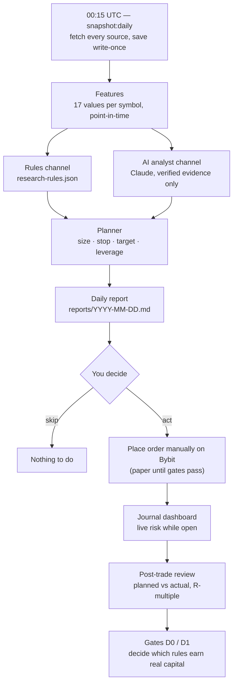

# Daily Workflow — Catalyst Research, Manual Execution, Trade Journal

Once a day, the system collects fundamental and catalyst data, runs your rules and the AI analyst on
the same point-in-time snapshot, and writes a report. **You** read it, decide, and place any order by
hand on Bybit. A local dashboard tracks the trade while it is open and reviews it after it closes.
Nothing trades automatically, and no plan may use real money or leverage until its gates pass.

> Contract: [`specs/daily-catalyst-manual-trading.md`](../specs/daily-catalyst-manual-trading.md).
> This guide explains how to *use* the system; the spec is the source of truth when they disagree.

---

## Status — what works today

| Phase | What it gives you | Status |
|-------|-------------------|--------|
| 1 — Data foundation | `npm run snapshot:daily`: fetch sources, save point-in-time snapshots, compute features | ✅ Built |
| 2 — Rules, planner, report | `npm run research:daily`: rules → sized trade plans → daily report | ✅ Built |
| 3 — Journal & dashboard | `npm run journal`: read-only fill import, live view, post-trade review | ✅ Built |
| 4 — Backtest & gates | `npm run backtest:daily`: Gate D0 (holdout) and Gate D1 (paper) verdicts | ⏳ Planned |
| 4b — AI analyst | Claude assesses each rule plan and proposes up to 3 ideas | ⏳ Planned |
| 5 — Analyst persona | Interactive Claude Code skill to write and critique rules | ⏳ Planned |

This table is updated at the end of every phase.

---

## The daily cycle



### Your 10-minute routine

1. **Read the banner** at the top of `reports/<today>.md`. `INCOMPLETE` means a source failed — plans that depend on it are marked `not_evaluable`, never guessed.
2. **Read the rules channel.** Each plan shows the rule that fired, the evidence values, entry reference, stop, target, size, leverage and liquidation buffer. The AI's stance (support / caution / oppose) sits next to it.
3. **Read the AI channel** (labeled *forward-only, unvalidated*): its regime summary, its own ideas, notes on your open trades.
4. **Decide.** Check `venueIntent`: `paper` means record it as a paper trade, not a real order.
5. **Act.** Place the order yourself on Bybit — or record the paper entry in the journal.
6. **Link it.** In the journal dashboard, link the position to its `planId` so it is measured against the plan.
7. **While open:** watch distance to stop, distance to liquidation, funding paid, and whether the thesis still holds.
8. **After close:** read the review, add notes. Adherence and R-multiple feed the gates.

---

## What each stage guarantees

| Stage | Guarantee | Why it matters |
|-------|-----------|----------------|
| Snapshot | Saved once, SHA-256 checked, never overwritten (`--revision N` adds a new file) | You can always see exactly what the system knew that day |
| Point-in-time rule | A value counts only if it was available at decision time | Prevents the look-ahead bias that makes backtests lie |
| Decision time | Scheduled 00:15 UTC; in a live run it becomes the moment the last fetch finished (if within 2 h) | Sources fetched seconds after 00:15 are still usable; backdated runs stay honest |
| Failure handling | Missing, stale or malformed data → `missing` / `not_evaluable`, loudly | The system never fills a gap with yesterday's value |
| Planner | Size from risk per trade and stop distance; leverage is an *output*; liquidation must be ≥ 2× the stop distance away | Leverage cannot be dialed up by hand or by the AI |
| AI analyst | Every claim must cite a snapshot value or a URL it actually retrieved; unverifiable claims are dropped | AI opinions never enter a money decision as unchecked "facts" |
| Journal | Read-only Bybit key, verified at startup; atomic writes with 5 backups | The system can see your account, never trade on it |

---

## Gates — the only path to real money

| Gate | Applies to | Pass condition (summary) | Command |
|------|-----------|--------------------------|---------|
| **D0 — holdout** | Each rule (not AI, not `forwardOnly` rules) | Last 12 months held out; ≥ 30 trades; mean R > 0 with 90% CI above 0; beats random-entry control; max 3 attempts per rule | `npm run backtest:daily -- --rule <id> --mode holdout` |
| **D1 — forward paper** | Each rule after D0; the AI channel; `forwardOnly` rules | ≥ 30 paper trades (60 for AI / forward-only) over ≥ 45 days; expectancy > 0; adherence ≥ 90% | `npm run backtest:daily -- --rule <id> --mode d1-check` |
| **Leverage ladder** | After D1 | First 20 live trades capped at 2×; raising `maxLeverage` is your manual config commit | — |

You review every gate artifact (`data/validation/daily/*.json`) and change a rule's `status` yourself.
Why the AI skips D0: its training data runs to May 2026, inside the holdout window — a backtest of it would be cheating.

---

## Setup

### One-time

| Item | How | Needed for |
|------|-----|-----------|
| `config.json` | Existing config; `symbols` drives which markets are researched | everything |
| `FRED_API_KEY` | Free key from FRED, exported in your shell | `hoursToNextCpi` |
| `data/manual/macro-calendar.json` | FOMC statement times (UTC). Seeded with the remaining 2026 meetings; keep `asOf` fresh (≤ 120 days) | `hoursToNextFomc` |
| `data/manual/unlocks.json` | Token unlocks for your symbols' base assets; update `asOf` at least weekly | `daysToNextUnlock`, `nextUnlockPctOfFloat` |
| Schedule | Run `npm run research:daily` at 00:15 UTC via cron or a systemd user timer (it takes the snapshot itself) | the daily cycle |
| `research-rules.json` | Your rule set. Ships with 3 `EXAMPLE` rules — replace them with your own (format below) | rules channel |
| Read-only Bybit key | Create an API key with **read-only** permission (no Trade, no Withdraw) and export `BYBIT_READONLY_API_KEY` / `BYBIT_READONLY_API_SECRET`. The journal refuses to start with any other key | live sync |
| `manual.journalStartTime` | ISO time in `config.json` (e.g. `"2026-09-17T00:00:00Z"`). Only executions after it are journaled, so old auto-trader history stays out | live sync |

Without the read-only key the dashboard runs in **paper-only mode** — useful for the whole paper phase (Gate D1).

Manual file formats:

```json
// data/manual/macro-calendar.json
{ "asOf": "2026-09-16", "events": [{ "type": "FOMC", "time": "2026-10-28T18:00:00Z" }] }

// data/manual/unlocks.json
{ "asOf": "2026-09-16", "unlocks": [{ "asset": "APT", "time": "2026-10-12T00:00:00Z", "pctOfCirculating": 1.1 }] }
```

### Farside is blocked — fallback

Farside currently answers `403` to the script. Until that changes, drop a CSV per asset and the adapter
uses it automatically:

```csv
date,totalUsdMillions
2026-09-15,-120.4
```

Paths: `data/manual/farside-btc.csv`, `data/manual/farside-eth.csv`. The file's modification time is
treated as when the data became available.

---

## Commands

| Command | What it does | Exit codes |
|---------|--------------|-----------|
| `npm run snapshot:daily` | Fetch all sources for today, save snapshots, print sources + features as JSON | 0 written · 3 already exists (use `--revision N`) · 4 decision time in the future |
| `npm run snapshot:daily -- --date 2026-09-15 --revision 1` | Re-snapshot a date as a new revision (backdated → scheduled decision time) | same |
| `npm run research:daily` | Snapshot → features → rules → plans → `reports/<date>.json` + `reports/<date>.md` | 0 written · 2 invalid `research-rules.json` (all issues printed, nothing written) · 3 report exists (use `--refetch`) · 4 decision time in the future |
| `npm run research:daily -- --refetch` | Re-run today as a new revision; nothing is overwritten | same |
| `npm run verify` | Typecheck + full test suite | non-zero on failure |

| `npm run journal` | Start the dashboard at <http://127.0.0.1:3082> (local only) | exits non-zero if the Bybit key has trade/withdraw permission or can't be verified; exit 5 from `research:daily` if the journal file is unreadable |

Both research commands accept `--snapshot-root DIR` and `--reports-root DIR` to write somewhere other
than `data/snapshots/` and `reports/` (useful for experiments). `research:daily` and `journal` accept
`--journal-path FILE` (default `manual-journal.json`). Commands for phases 4–4b are in the spec (§5.12)
and will be added here as each phase lands.

---

## The journal dashboard

`npm run journal`, then open <http://127.0.0.1:3082>. It only answers requests addressed to
`127.0.0.1`/`localhost`, so no other website in your browser can write to it.

| Panel | What you see | What you do there |
|-------|--------------|-------------------|
| Banners | paper-only mode · `STALE since <time>` (P&L blanked) · breaker tripped · funding sign unverified · sync warnings | Act on them before trusting numbers |
| Live trades | mark price, unrealized P&L, distance to stop %, distance to liquidation %, funding, hours held, hours left before the max-hold exit, thesis state, alerts | Watch risk; close by hand on Bybit when a stop/target/expiry/invalidation says so |
| Link to plan | unplanned positions | Pick the `planId` from that day's report. Linking is never automatic and is refused if symbol/side/timing don't match |
| Paper trades | forms for entry and exit | Record what you *would* have done while a rule is still `experimental` |
| Closed trades | planned vs actual, R-multiple, fees, funding, entry slippage, size deviation, MAE/MFE, exit kind, followed plan | Add notes; mark a discretionary exit as `thesis_invalidated` if that's why you closed |
| Stats (per venue) | win rate, expectancy in R, max drawdown in R, adherence, per rule, rules vs AI, and by AI stance | This is what the gates read |

### How your fills become trades

- A trade opens when a position goes from flat to non-flat and closes when it returns to flat. Adding
  size is an entry, reducing is an exit. Reversing through zero closes one trade and opens another.
- Positions opened **before** `journalStartTime` are never guessed: fills that close them are skipped
  with a warning (the dashboard shows it).
- Exits are labeled automatically: `liquidation`, `stop`/`target` (within a quarter of the stop
  distance), `time` (at the max hold), otherwise `discretionary`.
- If anything in the sync fails, **nothing** in the journal changes and the dashboard says `STALE`.

### Loss limits (circuit breaker)

Computed from your closed **live** trades, never from paper trades. While tripped, every plan in the
daily report is rejected with `breaker_tripped`.

| Limit | Config | Clears |
|-------|--------|--------|
| Daily loss | `maxDailyLossPercent` (default 10%) | Automatically at the next UTC day |
| Drawdown from peak | `maxDrawdownHaltPercent` (default 20%) | **Only when you set** `manual.breakerResetAt` to a time after the trip |
| Consecutive losses | `maxConsecutiveLosses` (default 5) | **Only when you set** `manual.breakerResetAt` |

Resetting is a deliberate, written decision — review what happened before you set it.

### One-time funding check

Funding sign is not yet verified against a real settlement, so every funding value shows
`sign unverified`. Hold one small real position through a funding time, compare with Bybit's
transaction log, then set `manual.fundingSignVerified: true`.

---

## Writing rules

A rule fires when **all** `entryWhenAll` conditions hold. If any feature it references is missing, the
rule is `not_evaluable` — it never fires on partial data.

```json
{
  "id": "etf-flow-momentum",
  "version": 1,
  "description": "Long when 5-day BTC ETF inflows are strong and price is trending up",
  "evidence": ["X1"],
  "status": "experimental",
  "symbols": ["SOL/USDT"],
  "side": "long",
  "entryWhenAll": [
    { "feature": "btcEtfNetFlowUsd5d", "op": ">", "value": 500000000 },
    { "feature": "return7d", "op": "between", "value": [0, 15] }
  ],
  "invalidateWhenAny": [{ "feature": "btcEtfNetFlowUsd1d", "op": "<", "value": -300000000 }],
  "stopAtrMultiple": 2,
  "targetRMultiple": 2,
  "maxHoldDays": 5,
  "forwardOnly": false,
  "origin": "rules-file"
}
```

| Field | Rule |
|-------|------|
| `id` | lowercase letters, digits, dashes (3–48). Renaming creates a new rule for the gates |
| `version` | bump on every change; the rule hash in reports changes with any edit |
| `status` | `experimental` → `holdout-passed` → `paper-passed` (only you change it, after gate artifacts) |
| `op` | `<`, `<=`, `>`, `>=`, or `between` with `[low, high]` inclusive |
| `stopAtrMultiple` / `targetRMultiple` / `maxHoldDays` | (0, 10] · (0, 20] · 1–10 |
| `forwardOnly` | `true` if the rule uses features without honest history (open interest, unlocks) |

An invalid file stops the run with every problem listed — fix them all, then re-run.

## How a plan is sized

1. Risk per trade = `maxCapitalUsd × riskPerTradePercent` (capped at 1%).
2. Stop distance = `atr14d × stopAtrMultiple`; quantity = risk ÷ stop distance.
3. Leverage = the minimum that fits the margin budget, capped (1× until a rule passes D1).
4. If liquidation is closer than 2× the stop distance, leverage is lowered; if it still fails → `liq_too_close`.
5. Quantity is rounded **down** to Bybit's step. Below Bybit's minimum order → `size_below_min`.

> With small capital, expect `size_below_min` on high-priced coins: $1 of risk with a wide stop can be
> less than one minimum lot. That rejection is the system protecting the risk limit, not a bug.

---

## Features reference

| Feature | Meaning | Source |
|---------|---------|--------|
| `close`, `return1d`, `return7d` | Latest daily close and % returns | Bybit daily candles |
| `atr14d`, `realizedVol7d` | Volatility: average true range; annualized realized vol % | Bybit daily candles |
| `fundingRate8hAvg3d`, `fundingRatePercentile90d` | Funding level and how extreme it is vs 90 days | Bybit funding history |
| `oiChange3dPct` | Open-interest change over 3 days | Bybit open interest |
| `btcEtfNetFlowUsd1d`, `btcEtfNetFlowUsd5d`, `ethEtfNetFlowUsd1d` | Spot ETF net flows (USD) | Farside |
| `stablecoinSupplyChange7dPct` | Total stablecoin supply change | DefiLlama |
| `fearGreed` | Sentiment index 0–100 | alternative.me |
| `hoursToNextFomc`, `hoursToNextCpi` | Time to the next macro event | manual calendar, FRED |
| `daysToNextUnlock`, `nextUnlockPctOfFloat` | Next token unlock (999 / 0 when none within 90 days) | manual unlocks file |

Exact formulas: spec §5.3a. Evidence strength behind each data family: spec §2.2.

---

## Checklist before acting on any plan

- [ ] Report banner is not `INCOMPLETE` for the features this plan uses
- [ ] `venueIntent` is `live` — otherwise it is a paper trade
- [ ] Leverage and size match the plan; liquidation is beyond the stop
- [ ] You linked the position to its `planId` in the journal
- [ ] You know the invalidation conditions and the expiry time
