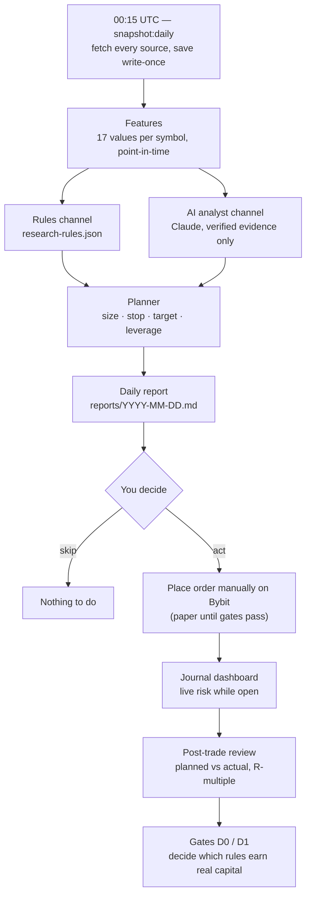

# Daily Workflow — Catalyst Research, Manual Execution, Trade Journal

Once a day, the system collects fundamental and catalyst data, runs your rules and the AI analyst on
the same point-in-time snapshot, and writes a report. **You** read it, decide, and place any order by
hand on Bybit. A local dashboard tracks the trade while it is open and reviews it after it closes.
Nothing trades automatically, and no plan may use real money or leverage until its gates pass.

> Contract: [`specs/daily-catalyst-manual-trading.md`](../specs/daily-catalyst-manual-trading.md).
> This guide explains how to *use* the system; the spec is the source of truth when they disagree.

---

## Status — what works today

| Phase | What it gives you | Status |
|-------|-------------------|--------|
| 1 — Data foundation | `npm run snapshot:daily`: fetch sources, save point-in-time snapshots, compute features | ✅ Built |
| 2 — Rules, planner, report | `npm run research:daily`: rules → sized trade plans → daily report | 🚧 In progress |
| 3 — Journal & dashboard | `npm run journal`: read-only fill import, live view, post-trade review | ⏳ Planned |
| 4 — Backtest & gates | `npm run backtest:daily`: Gate D0 (holdout) and Gate D1 (paper) verdicts | ⏳ Planned |
| 4b — AI analyst | Claude assesses each rule plan and proposes up to 3 ideas | ⏳ Planned |
| 5 — Analyst persona | Interactive Claude Code skill to write and critique rules | ⏳ Planned |

This table is updated at the end of every phase.

---

## The daily cycle



### Your 10-minute routine

1. **Read the banner** at the top of `reports/<today>.md`. `INCOMPLETE` means a source failed — plans that depend on it are marked `not_evaluable`, never guessed.
2. **Read the rules channel.** Each plan shows the rule that fired, the evidence values, entry reference, stop, target, size, leverage and liquidation buffer. The AI's stance (support / caution / oppose) sits next to it.
3. **Read the AI channel** (labeled *forward-only, unvalidated*): its regime summary, its own ideas, notes on your open trades.
4. **Decide.** Check `venueIntent`: `paper` means record it as a paper trade, not a real order.
5. **Act.** Place the order yourself on Bybit — or record the paper entry in the journal.
6. **Link it.** In the journal, link the position to its `planId` so it is measured against the plan.
7. **While open:** watch distance to stop, distance to liquidation, funding paid, and whether the thesis still holds.
8. **After close:** read the review, add notes. Adherence and R-multiple feed the gates.

---

## What each stage guarantees

| Stage | Guarantee | Why it matters |
|-------|-----------|----------------|
| Snapshot | Saved once, SHA-256 checked, never overwritten (`--revision N` adds a new file) | You can always see exactly what the system knew that day |
| Point-in-time rule | A value counts only if it was available at decision time | Prevents the look-ahead bias that makes backtests lie |
| Decision time | Scheduled 00:15 UTC; in a live run it becomes the moment the last fetch finished (if within 2 h) | Sources fetched seconds after 00:15 are still usable; backdated runs stay honest |
| Failure handling | Missing, stale or malformed data → `missing` / `not_evaluable`, loudly | The system never fills a gap with yesterday's value |
| Planner | Size from risk per trade and stop distance; leverage is an *output*; liquidation must be ≥ 2× the stop distance away | Leverage cannot be dialed up by hand or by the AI |
| AI analyst | Every claim must cite a snapshot value or a URL it actually retrieved; unverifiable claims are dropped | AI opinions never enter a money decision as unchecked "facts" |
| Journal | Read-only Bybit key, verified at startup; atomic writes with 5 backups | The system can see your account, never trade on it |

---

## Gates — the only path to real money

| Gate | Applies to | Pass condition (summary) | Command |
|------|-----------|--------------------------|---------|
| **D0 — holdout** | Each rule (not AI, not `forwardOnly` rules) | Last 12 months held out; ≥ 30 trades; mean R > 0 with 90% CI above 0; beats random-entry control; max 3 attempts per rule | `npm run backtest:daily -- --rule <id> --mode holdout` |
| **D1 — forward paper** | Each rule after D0; the AI channel; `forwardOnly` rules | ≥ 30 paper trades (60 for AI / forward-only) over ≥ 45 days; expectancy > 0; adherence ≥ 90% | `npm run backtest:daily -- --rule <id> --mode d1-check` |
| **Leverage ladder** | After D1 | First 20 live trades capped at 2×; raising `maxLeverage` is your manual config commit | — |

You review every gate artifact (`data/validation/daily/*.json`) and change a rule's `status` yourself.
Why the AI skips D0: its training data runs to May 2026, inside the holdout window — a backtest of it would be cheating.

---

## Setup

### One-time

| Item | How | Needed for |
|------|-----|-----------|
| `config.json` | Existing config; `symbols` drives which markets are researched | everything |
| `FRED_API_KEY` | Free key from FRED, exported in your shell | `hoursToNextCpi` |
| `data/manual/macro-calendar.json` | FOMC statement times (UTC). Seeded with the remaining 2026 meetings; keep `asOf` fresh (≤ 120 days) | `hoursToNextFomc` |
| `data/manual/unlocks.json` | Token unlocks for your symbols' base assets; update `asOf` at least weekly | `daysToNextUnlock`, `nextUnlockPctOfFloat` |
| Schedule | Run `npm run snapshot:daily` (Phase 2+: `research:daily`) at 00:15 UTC via cron or a systemd user timer | the daily cycle |

Manual file formats:

```json
// data/manual/macro-calendar.json
{ "asOf": "2026-09-16", "events": [{ "type": "FOMC", "time": "2026-10-28T18:00:00Z" }] }

// data/manual/unlocks.json
{ "asOf": "2026-09-16", "unlocks": [{ "asset": "APT", "time": "2026-10-12T00:00:00Z", "pctOfCirculating": 1.1 }] }
```

### Farside is blocked — fallback

Farside currently answers `403` to the script. Until that changes, drop a CSV per asset and the adapter
uses it automatically:

```csv
date,totalUsdMillions
2026-09-15,-120.4
```

Paths: `data/manual/farside-btc.csv`, `data/manual/farside-eth.csv`. The file's modification time is
treated as when the data became available.

---

## Commands

| Command | What it does | Exit codes |
|---------|--------------|-----------|
| `npm run snapshot:daily` | Fetch all sources for today, save snapshots, print sources + features as JSON | 0 written · 3 already exists (use `--revision N`) · 4 decision time in the future |
| `npm run snapshot:daily -- --date 2026-09-15 --revision 1` | Re-snapshot a date as a new revision (backdated → scheduled decision time) | same |
| `npm run verify` | Typecheck + full test suite | non-zero on failure |

Commands for phases 2–4b are listed in the spec (§5.12) and will be added here as each phase lands.

---

## Features reference

| Feature | Meaning | Source |
|---------|---------|--------|
| `close`, `return1d`, `return7d` | Latest daily close and % returns | Bybit daily candles |
| `atr14d`, `realizedVol7d` | Volatility: average true range; annualized realized vol % | Bybit daily candles |
| `fundingRate8hAvg3d`, `fundingRatePercentile90d` | Funding level and how extreme it is vs 90 days | Bybit funding history |
| `oiChange3dPct` | Open-interest change over 3 days | Bybit open interest |
| `btcEtfNetFlowUsd1d`, `btcEtfNetFlowUsd5d`, `ethEtfNetFlowUsd1d` | Spot ETF net flows (USD) | Farside |
| `stablecoinSupplyChange7dPct` | Total stablecoin supply change | DefiLlama |
| `fearGreed` | Sentiment index 0–100 | alternative.me |
| `hoursToNextFomc`, `hoursToNextCpi` | Time to the next macro event | manual calendar, FRED |
| `daysToNextUnlock`, `nextUnlockPctOfFloat` | Next token unlock (999 / 0 when none within 90 days) | manual unlocks file |

Exact formulas: spec §5.3a. Evidence strength behind each data family: spec §2.2.

---

## Checklist before acting on any plan

- [ ] Report banner is not `INCOMPLETE` for the features this plan uses
- [ ] `venueIntent` is `live` — otherwise it is a paper trade
- [ ] Leverage and size match the plan; liquidation is beyond the stop
- [ ] You linked the position to its `planId` in the journal
- [ ] You know the invalidation conditions and the expiry time
